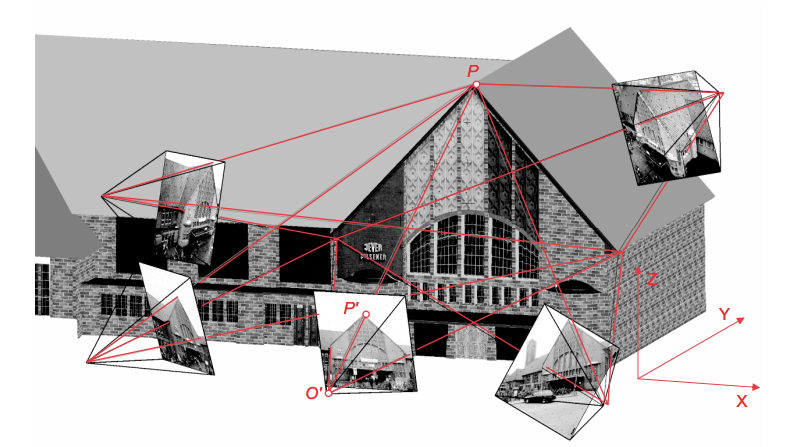
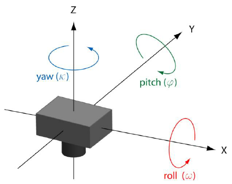
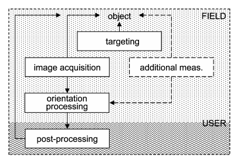
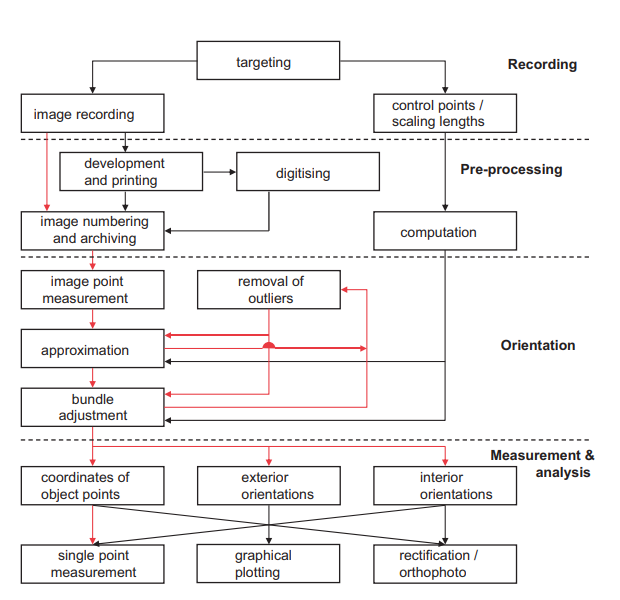

# Close-Range Photogrammetry Approach

Фотограмметрия включает в себя методы измерения и интерпретации изображений с целью получения формы и
местоположения объекта из одной или нескольких фотографий, на которых присутствует данный объект.
Одно из применений фотограмметрии - трехмерная реконструкция объекта.

Фотограмметрия - это метод трехмерного измерения, который использует центральную проекционную визуализацию в качестве 
фундаментальной математической модели. 

Форма и положение объекта определяется путем реконструкции пучков лучей, в которых для каждого снимка камеры каждая
точка изображения *P'* вместе с соответствующим перспективным центром *O'* определяет пространственное направление луча 
в соответствующую точку объекта *P*. 
При пересечении как минимум двух соответствующих лучей из двух снимков можно однозначно определить точку трехмерного
объекта P как на рис. 1

 Рисунок 1 - Принцип работы фотограмметрического подхода 

В стереофотограмметрии используется пара камер для достижения этой цели. В multi-image фотограмметрии используется еще 
большее количество камер, что увеличивает количество лучей для каждой точки модели. 

* Внутренней ориентации (interior orientation)

Параметры внутренней ориентации описывают внутреннюю геометрическую модель камеры. 
Если в качестве основы взять модель камеры-обскуры (рис. 2), наиболее важным эталонным местоположением будет центр 
перспективы *О*, через который проходят все лучи изображения. Внутренния ориентация определяет положение центра перспективы 
относительно системы отсчета, зафиксированной в камере (система координат изображения), а также отклонения от идеальной
центральной проекции (искажение изображения). Наиболее важным параметром внутренней ориентации является главное
расстояние *С*, которое определяет расстояние между плоскостью изображения и центром перспективы.

Реальная фотограмметрическая камера будет отличаться от теоретической модели камеры-обскуры. Использование
относительно сложного объектива, не стабильный процесс съекмки, из-за этих факторов возникает отклонение от 
идеальной геометрии изображения. Внутренния ориентация обычно определяется калибровкой для каждой камеры для того, чтобы
исправить эти отколнения. 

 Рисунок 2 - Модель камеры-обскуры 

* Внешняя ориентация (exterior orientation)

Параметры внешнего ориентирования определяют пространственное положение и ориентацию камеры в глобальной системе 
координат. Внешняя ориентация описывается координатами центра перспективы в глобальной системе координат и тремя
углами, выражающих вращение системы координат изображения относительно глобальной системы (тангаж,рыскание, крен). 
Пример системы координат представлен на рис. 3 

 Рисунок 3 - Внешняя система кординат камеры 

Параметры внешнего ориентирования рассчитываются косвенно на основе координат выделенных ярко выраженных
точек (features) на изображении и известными глобальными координатами.

// TODO by Google Translate
Каждая измеренная точка изображения соответствует пространственному направлению от центра проекции к точке объекта. Длина вектора направления изначально неизвестна, то есть каждая точка объекта, лежащая на линии этого вектора, генерирует одну и ту же точку изображения. Другими словами, хотя каждая точка трехмерного объекта преобразуется в уникальную точку изображения для заданных параметров ориентации, однозначное изменение проекции невозможно. Точка объекта может быть расположена на луче изображения и, таким образом, абсолютно определена в пространстве объекта, только путем пересечения луча с дополнительным известным геометрическим элементом, таким как второе пространственное направление или плоскость объекта. Каждое изображение генерирует пространственный пучок лучей, определенный точками изображения и центром перспективы, в котором все лучи были записаны в один и тот же момент времени. Если все пучки лучей из нескольких изображений пересекаются, как описано выше, создается плотная сеть; для соответствующей конфигурации формирования изображения такая сеть обладает потенциалом высокой геометрической прочности. Используя метод триангуляции пучков, можно одновременно ориентировать любое количество изображений (пучков лучей) вместе с вычислением местоположений точек соответствующих трехмерных объектов.

* Система 

Фотограмметрический процесс существенно изменился с развитием цифровых систем обработки изображений 
и обработки (рис. 4). Используя соответствующие целевые точки объекта (features) и цифровую запись
изображений в режиме онлайн, сложные фотограмметрические задачи могут быть выполнены за считанные 
минуты на месте. Полностью автоматический анализ features заменяет ручные процедуры для определения ориениации
и положения камеры. Специальные фотограмметрические измерительные приборы больше не требуются
и заменяются стандартным камерами. Высокая степень автоматизации также позволяет пользователям, 
не являющимся специалистами, осуществлять фотограмметрическую запись.

 Рисунок 4 - Цифровая фотограмметрическая система 

* Процесс записи и анализа

На рис. 5  показаны основные процедуры Close-Range фотограмметрии.

 Рисунок 5 - Процесс записи и обработки 

1. Запись (Recording)
    - Нацеливание (Targeting) - выбор цели и привязка к объектам для улучшения автоматизации и увеличения точности измерения цели на изображениях.
    - Определение контрольных точек или масштабных длин (control points / scaling lengths) - создание глобальной системы координат объекта по определению целевых точек (features) и / или эталонных длин
    - Запись изображения (Image recording) - аналоговая или цифровая запись изображения объекта с помощью фотограмметрической системы
2. Предварительная подготовка (Pre-processing) 
    - Расчет (Computation) - расчет координат features и / или расстояния от результатов съемки.
    - Разработка и печать (Development and printing):
    - Оцифровка (Digitising) - преобразование аналоговых фотографий в цифровые изображения.
    - Нумерация и архивирование (Numbering and archiving) - назначение номеров фотографиям для идентификации отдельных
 изображений и архивирование или хранение фотографиий
3. Ориентация (Orientation)
    - Измерение точек изображения (Measurement of image points) - идентификация и измерение контрольных и масштабных точек
    - Приближение (Approximation) - расчет приблизительных значений для неизвестных величин для расчета bundle adjustment
    - Настройка пучка (bundle adjustment)- алгоритм, который одновременно рассчитывает внутренние и внешние параметры ориентации,
     а также координаты точек объекта, которые требуются для последующего анализа
    - Удаление выбросов (Removal of outliers) - обнаружение и устранение грубых ошибок
4. Измерение и анализ (Measurement and Analysis)
    - Измерение в одной точке (Single point measurement) - расчет координат точек трехмерного объекта для дальнейшей числовой обработки
    - Графическое изображение (Graphical plotting) - генерация трехмерной цифровой модели
    - Выпрямление/Ортофото (Rectification/Orthophoto) - Генерация преобразованных изображений или мозаик изображений, которые устраняют эффекты наклона относительно базовой плоскости (выпрямление) и / или устранение влияния перспективы (Ортофотоснимок)

Данный процесс в значительной степени может быть автоматизирована (соединения на рис. 5 отмеченные красным цветом). [1]

# Reference
1. Luhmann T. et al. Close Range Photogrammetry: Principles //Methods and Applications. – 2006. – С. 528.
